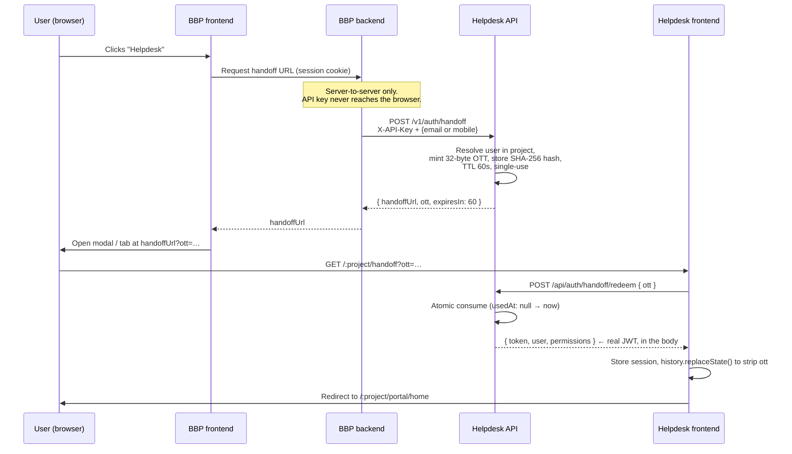

# BBP ↔ Helpdesk Integration — Technical Specification

**Status:** Draft for implementation
**Target codebase:** SAC Helpdesk (backend + frontend)
**Author:** Engineering
**Date:** 2026-08-24

> **Note on file/symbol names.** Paths and symbol names in this document were
> verified against the `prod-sac` branch of the SAC Helpdesk repo. If you are
> implementing on a different branch/environment, treat them as a map rather
> than gospel — the shapes are the same, the exact filenames may differ.

---

## 1. Objective

Let a user who is already authenticated on the **BBP platform** click a
"Helpdesk" button and land inside the Helpdesk — already logged in, with no
second password, no OTP, and **no long-lived credential ever placed in a URL**.

Once inside, the same user can:

- Raise a ticket through a form pre-filled with their BBP profile (name, email, mobile)
- See **My Tickets** — everything they raised
- See **Assigned to Me** — everything routed to them for resolution
- Reply inside any ticket, attach files, and take whatever actions their
  permissions allow

A single BBP user is therefore **both a requester and a resolver**. This is the
governing design constraint — see §7.

---

## 2. What already exists (do not rebuild)

A large part of this integration is already shipped. Read this section before
estimating.

### 2.1 Public API — `/v1/*`

`backend/src/routes/publicApi.ts` exposes an API-key-authenticated surface for
external platforms. Authentication is handled by
`backend/src/middleware/validatePublicApiKey.ts`, which resolves the **project
from the key itself** — the consumer never needs to send a project ID.

| Endpoint | Purpose |
|---|---|
| `POST /v1/users` | Create/push a user into the Helpdesk |
| `GET /v1/users/lookup` | Look a user up by mobile, scoped to the key's project |
| `GET /v1/tickets/form-schema` | Fetch the project's dynamic form field schema |
| `POST /v1/tickets` | Create a ticket |
| `POST /v1/tickets/lms-form` | Create a ticket from a multipart form (with attachment) |
| `GET /v1/tickets/search` | Search tickets |
| `GET /v1/tickets/by-number/:ticketNumber` | Fetch one ticket |
| `GET /v1/tickets/count` | Ticket counts |

All routes are rate-limited **per API key** (not per IP), which is the correct
behaviour for a server-to-server consumer.

**Step 1 of the flow — "BBP creates a user and pushes it to Helpdesk" — is
already fully supported by `POST /v1/users`.** No new work.

### 2.2 Student-facing portal

`frontend/src/App.tsx` already routes a complete requester experience under a
per-project URL prefix (`/:customUrlPath/...`):

| Route | Component | What it does |
|---|---|---|
| `/:project/student/submit-ticket` | `AuthenticatedStudentSubmitTicket` | Dynamic form, fields auto-filled from the session |
| `/:project/student/my-tickets` | `MyTickets` (`isStudentView`) | List of tickets raised by the user |
| `/:project/student/ticket/:ticketId` | `StudentTicketDetail` | Thread view — reply, attach files |
| `/:project/student/dashboard` | `SimpleStudentDashboard` | Landing view |
| `/:project/student/faq`, `/:project/kb` | FAQ / Knowledge Base | Self-service |

Reply-with-attachment is live and now accepts files up to **100 MB**
(`REPLY_ATTACHMENT_CONFIG` in `frontend/src/config/constants.ts`, mirrored by the
multer limit in `backend/src/controllers/ticketController.ts`).

### 2.3 A token-handoff page already exists as a working template

`frontend/src/pages/SsoCallback.tsx` already does exactly the shape of thing we
need: read a short-lived credential off the URL, exchange it over HTTPS for a
real session, store the session, and navigate onward. **Model the new handoff
page on this file** rather than inventing a new pattern.

### 2.4 Session storage

`frontend/src/utils/authToken.ts` is the single, centralised owner of the
session. Everything goes through `authTokenUtils` — never touch `localStorage`
directly. Note `isStudentSession()`: the student pages and the admin portal
share one `authToken` key, and that function is what keeps an admin in another
tab from being mistaken for a student.

---

## 3. The one real gap

**There is no machine-to-machine login endpoint.**

- `backend/src/routes/studentAuth.ts` — password and OTP only. Requires a human.
- `POST /api/auth/impersonate/:userId` — gated on the `IMPERSONATE_USER`
  permission and audited as a human action. **Do not reuse this for BBP.**
  Machine handoff and human impersonation must stay separate concerns with
  separate audit trails; conflating them makes the impersonation audit log
  useless for compliance.

Everything in this spec exists to close that one gap safely.

---

## 4. Security design — the token handoff

This section answers the central question: *how do we pass a session across two
platforms without the token being exposed or reused by anyone else?*

### 4.1 Why not just put the JWT in the URL

The naive version of this flow — BBP's backend calls a Helpdesk login API, gets
a JWT, and appends `?token=eyJ...` to the iframe URL — is the design to avoid.
A URL is not a private channel:

- It is written to **browser history** and stays there
- It is written to **server access logs** — the Helpdesk's own nginx logs, any
  CDN, any proxy in between
- It leaks via the **`Referer` header** to every third-party asset the page
  loads. `nginx.conf` currently sets `Referrer-Policy: no-referrer-when-downgrade`,
  which does **not** stop HTTPS→HTTPS cross-origin referrer leakage
- It is captured by **analytics and session-replay tools**
- It survives being copy-pasted into chat, email, or a bug report

A full-lifetime JWT in any of those places is a full account takeover, valid
until it expires.

### 4.2 The pattern to implement: one-time handoff ticket (OTT)

Put a **credential that is worthless within a minute** in the URL, and move the
real token over a POST body that never touches a URL.



### 4.3 Rules the implementation must follow

**The OTT itself**

1. **32 bytes minimum from a CSPRNG.** `crypto.randomBytes(32).toString("base64url")`.
   Never a UUID, never anything derived from the user ID or timestamp.
2. **Stored hashed.** Persist `sha256(ott)`, never the plaintext. A database
   leak must not yield usable tickets. This mirrors how `PublicApiKey` already
   bcrypt-hashes API keys.
3. **TTL of 60 seconds.** The gap between mint and redeem is one page load. Make
   it configurable but cap it — anything above 300s should be rejected at config load.
4. **Single use, consumed atomically.** Redemption must be one
   `findOneAndUpdate({ tokenHash, usedAt: null, expiresAt: { $gt: now } }, { $set: { usedAt: now } })`.
   Do **not** read-then-write — two parallel redeems would both succeed.
   A second redeem returns `401 HANDOFF_ALREADY_USED`.
5. **Bound to the project** resolved from the API key. An OTT minted with
   project A's key can never produce a session in project B.
6. **Deleted on a TTL index** (`expireAfterSeconds` on `expiresAt`) so consumed
   and expired tickets clear themselves.

**The session token it produces**

7. **Distinct audience claim.** Mint the JWT with `aud: "bbp-embed"` (or an
   equivalent `source: "BBP_HANDOFF"` claim). The auth middleware should refuse
   an embed-audience token on admin-only routes. If the embed session is ever
   stolen, the blast radius is the requester portal, not the admin console.
8. **Shorter lifetime than a normal login** — 2 hours is a reasonable default.
   The user can always re-enter from BBP; there is no re-login friction to protect.
9. **BBP must not be able to influence the lifetime.** Never read a TTL,
   role, or permission set from the handoff request body.

**Transport and surface**

10. **Strip the OTT from the address bar immediately** on the handoff page:
    `window.history.replaceState({}, "", cleanUrl)` before any other navigation.
11. **`Referrer-Policy: no-referrer`** on the handoff route specifically. The
    global `no-referrer-when-downgrade` in `nginx.conf` is not sufficient.
12. **Rate-limit `/v1/auth/handoff` per API key** — reuse the existing
    `makeRateLimit()` helper in `publicApi.ts`. 60/min is a sensible start.
13. **Redemption is POST-only.** A GET endpoint would be prefetched by browsers
    and link scanners, silently burning the ticket.
14. **The BBP API key lives server-side only.** If it ever appears in BBP's
    frontend bundle, anyone can mint a session for any user in the project. Call
    this out explicitly to the BBP team — it is the single highest-impact
    failure mode in this design.

**Audit**

15. **Log both halves.** Mint and redeem each get an audit entry: API key id,
    target user, project, IP, user agent, outcome. Feed these into the existing
    access/activity log infrastructure. A mint with no matching redeem within
    the TTL is a signal worth alerting on.

### 4.4 Optional hardening (decide per risk appetite)

- **IP binding.** BBP passes the end user's IP at mint; redeem compares. Real
  users on mobile networks do change IP mid-session, so **log a mismatch rather
  than hard-failing** unless you have evidence the population is stable.
- **Request signing.** BBP HMACs `timestamp + body` with a shared secret and
  sends it as `X-Signature`; Helpdesk rejects skew beyond ±5 min. This makes a
  leaked API key alone insufficient. Worth it if the key crosses org boundaries.
- **Key rotation.** `PublicApiKey` already carries `isActive` — support two
  active keys per project so BBP can rotate without downtime.

### 4.5 Iframe vs. new tab

The described flow opens a **modal**, which implies an iframe. That is
acceptable, but note: **the security of this design comes from the OTT pattern,
not from the embed mode.** The iframe adds its own separate concerns.

| | Iframe in BBP modal | New tab / redirect |
|---|---|---|
| Token exposure | Same (OTT protects both) | Same |
| Clickjacking | Must pin `frame-ancestors` | Not applicable |
| nginx change | Required — see §8 | None |
| Storage partitioning | localStorage is partitioned per-embedding-site in Safari ITP and Chrome; session will not persist outside the modal | Works as today |
| UX | Stays in BBP context | Leaves BBP context |

**Recommendation:** ship **new tab for v1** if the timeline is tight — it is
strictly less to get wrong. Move to the iframe modal as a fast follow once
`frame-ancestors` is pinned to the exact BBP origins.

If you go straight to the iframe, the storage partitioning point is the one that
surprises people: inside a third-party iframe the Helpdesk gets its **own
isolated `localStorage` bucket**. That is good for isolation (an embed session
cannot leak into an admin tab and vice versa) but it means the user re-handoffs
each time the modal opens. Design for that — the handoff is cheap.

---

## 5. API contracts

### 5.1 `POST /v1/auth/handoff` — mint a handoff ticket

Server-to-server. Called by BBP's backend, never by a browser.

**Headers**

```
X-API-Key: <bbp project api key>
Content-Type: application/json
```

**Request**

```json
{
  "email": "asha.verma@example.com",
  "mobile": "919876543210",
  "returnPath": "/student/submit-ticket",
  "clientIp": "203.0.113.7"
}
```

| Field | Required | Notes |
|---|---|---|
| `email` | one of email/mobile | Matched within the API key's project |
| `mobile` | one of email/mobile | Normalised the same way `lookupUser` does |
| `returnPath` | no | Where to land after redeem. **Allowlist it** — see below |
| `clientIp` | no | For the optional IP-binding check (§4.4) |

`returnPath` must be validated against a server-side allowlist of relative
paths. Accepting an arbitrary value makes this an open redirect: BBP could hand
a user a Helpdesk-origin URL that bounces them to an attacker's site with a live
session. Reject anything containing a scheme, a protocol-relative `//` prefix,
or a `..` segment.

**Response — 200**

```json
{
  "status": "success",
  "data": {
    "ott": "8vQ2v3n0Xk...",
    "handoffUrl": "https://helpdesk.hubblehox.ai/bbp/handoff?ott=8vQ2v3n0Xk...",
    "expiresIn": 60,
    "user": { "id": "...", "fullName": "Asha Verma", "email": "..." }
  }
}
```

**Errors**

| Status | Code | Meaning |
|---|---|---|
| 400 | `BAD_REQUEST` | Neither email nor mobile supplied |
| 400 | `INVALID_RETURN_PATH` | `returnPath` failed allowlist validation |
| 401 | `INVALID_API_KEY` | Key missing, wrong, or revoked |
| 404 | `USER_NOT_FOUND` | No user with that identifier **in this project** |
| 403 | `USER_INACTIVE` | User exists but is deactivated |
| 429 | `RATE_LIMIT_EXCEEDED` | Per-key limit hit |

On `USER_NOT_FOUND`, BBP should call `POST /v1/users` to push the user, then
retry the handoff. Decide explicitly whether you want **auto-provisioning** —
minting a Helpdesk user on the fly during handoff. It is convenient and it also
means anyone holding the API key can populate your user table. If you enable it,
make it a per-project flag, default off.

### 5.2 `POST /api/auth/handoff/redeem` — exchange OTT for a session

Called by the Helpdesk frontend. Public route, no auth middleware — the OTT *is*
the credential.

**Request**

```json
{ "ott": "8vQ2v3n0Xk..." }
```

**Response — 200**

```json
{
  "success": true,
  "data": {
    "token": "eyJhbGciOi...",
    "expiresIn": 7200,
    "user": {
      "id": "...", "fullName": "Asha Verma",
      "email": "...", "mobile": "...",
      "roleCode": "BBP_USER", "projectId": "...", "projectPath": "bbp"
    },
    "permissions": ["TICKET_CREATE", "TICKET_VIEW_OWN", "TICKET_ADD_COMMENT"],
    "returnPath": "/student/submit-ticket"
  }
}
```

**Errors** — all `401`, and all with the **same generic message** so the
endpoint cannot be used to probe which tickets exist:

| Code | Meaning |
|---|---|
| `HANDOFF_INVALID` | No matching ticket |
| `HANDOFF_EXPIRED` | Past `expiresAt` |
| `HANDOFF_ALREADY_USED` | `usedAt` already set — possible replay, log loudly |

Rate-limit this endpoint per IP as well; it is publicly reachable.

---

## 6. Data model

### 6.1 New collection: `handoffTickets`

```ts
{
  tokenHash:  string;    // sha256(ott), indexed, unique
  userId:     ObjectId;  // ref User
  projectId:  ObjectId;  // ref Project — from the API key
  apiKeyId:   ObjectId;  // ref PublicApiKey — who minted it
  returnPath: string;    // validated relative path
  clientIp?:  string;
  expiresAt:  Date;      // TTL index, expireAfterSeconds: 0
  usedAt:     Date | null;
  createdAt:  Date;
}
```

Indexes: unique on `tokenHash`; TTL on `expiresAt`; compound
`{ userId: 1, createdAt: -1 }` for audit queries.

### 6.2 User model

Add a provenance marker so BBP-originated users are identifiable without
guessing from the email domain:

```ts
externalSource?: "BBP" | null;
externalUserId?: string | null;   // BBP's own user id — index it
```

`externalUserId` also gives BBP a stable key for re-sync, which is better than
matching on email (people change emails; tickets should not be orphaned).

---

## 7. Roles — one user, both views

BBP users **raise and receive** tickets. The model is: **one BBP user → one
Helpdesk user → one role**, and what they can do comes from the permissions
attached to that role in RBAC. Do not create two accounts per person.

### 7.1 The landing page

Build a combined portal home for BBP users with two tabs:

```
┌─────────────────────────────────────────────┐
│  Raise a Request   │  My Tickets  │  Assigned to Me  │
└─────────────────────────────────────────────┘
```

| Tab | Data | Reuse |
|---|---|---|
| Raise a Request | Project's dynamic form, pre-filled from session | `AuthenticatedStudentSubmitTicket` |
| My Tickets | `raisedBy = me` | `MyTickets` with `isStudentView` |
| Assigned to Me | `assignedTo = me` | `MyTickets` with a different filter |

**Hide the "Assigned to Me" tab entirely when the user has no assignable
permission** — most BBP users will only ever raise. Render it from the
permission list returned by redeem, not from a hardcoded role name. This
codebase has been deliberately moving away from hardcoded role checks; follow
that.

### 7.2 Permissions

Suggested starting set for a plain BBP requester:

```
TICKET_CREATE, TICKET_VIEW_OWN, TICKET_ADD_COMMENT, TICKET_ATTACH_FILE
```

For a BBP user who also resolves, add whatever your resolver role already
carries (`TICKET_VIEW_ASSIGNED`, `TICKET_UPDATE_STATUS`, `TICKET_REASSIGN`, …).
Define these as a **role in RBAC**, not as a code branch.

### 7.3 ISR

ISR is out of scope for this document — it is not modelled in this codebase
(the only trace is a comment in `NotificationSettingsPage.tsx` referencing a
"PSR/ISR lifecycle"). Before implementing, settle:

- Is ISR a **role** (staff who resolve), a **request type** (a category with its
  own form and SLA), or both?
- If it is a request type, it maps to an existing **category + form schema +
  SLA policy** — no new code, just configuration.
- If it is a role, it maps to §7.2 — a role with resolver permissions, and those
  users get the "Assigned to Me" tab.

Most likely it is configuration, not code. Confirm before estimating.

---

## 8. Frontend work

### 8.1 New route — the handoff page

```
/:customUrlPath/handoff?ott=…
```

Model it on `frontend/src/pages/SsoCallback.tsx`. Order of operations matters:

1. Read `ott` from the query string
2. **`history.replaceState()` to strip it** — before anything async
3. `POST /api/auth/handoff/redeem`
4. On success: store via `authTokenUtils.setToken()` plus the user/permission
   keys the app expects, then `navigate(returnPath, { replace: true })`
5. On failure: a plain error card. **Never echo the OTT** into the error text or
   into any client-side error reporting

### 8.2 Combined portal home

New route `/:customUrlPath/portal/home` rendering the three tabs from §7.1.
Reuse the existing components — this should be a container, not a rewrite.

### 8.3 If embedding in an iframe

- Suppress the outer chrome. `AuthenticatedStudentSubmitTicket` already takes
  `hideHeader` — extend that pattern rather than forking components
- `postMessage` the document height to the parent so the BBP modal can size
  itself; and a `{ type: "helpdesk:close" }` message so in-app actions can close
  the modal
- **Validate `event.origin`** on both ends of every `postMessage`. An unchecked
  listener is a cross-origin injection point
- Confirm file upload works inside the frame — it does, but test it, because
  attachment upload in an iframe is a classic regression

---

## 9. Infrastructure changes

### 9.1 nginx — only if embedding in an iframe

`nginx.conf` currently sends `X-Frame-Options: SAMEORIGIN`, which blocks the
Helpdesk from rendering inside a BBP modal.

```nginx
# Handoff route: never leak the OTT via Referer
location /bbp/handoff {
    add_header Referrer-Policy "no-referrer" always;
    try_files $uri $uri/ /index.html;
}
```

To allow framing, **replace** the `X-Frame-Options` header with a pinned CSP —
do not simply delete it:

```nginx
add_header Content-Security-Policy "frame-ancestors 'self' https://bbp.example.com" always;
```

`frame-ancestors` supersedes `X-Frame-Options` in every modern browser and,
unlike it, supports an allowlist. **Pin exact origins.** Never `*`, never a bare
wildcard subdomain unless every host under it is trusted — a wildcard here is
a clickjacking hole.

Note that `X-Frame-Options`/CSP is set globally in the server block today. If
only the embed routes should be framable, scope the header to those `location`
blocks and leave the admin console unframable.

### 9.2 CORS

`POST /api/auth/handoff/redeem` is called from the Helpdesk's own origin, so no
CORS change is needed for it. `/v1/auth/handoff` is server-to-server — also no
CORS. If BBP's frontend ever calls Helpdesk APIs directly, that is a separate
decision; prefer keeping all `/v1` traffic server-side.

### 9.3 Upload sizes

Already handled portal-wide at **100 MB** (multer limits, express body parsers,
`client_max_body_size 100M` in nginx). If BBP proxies uploads through its own
backend, that proxy needs a matching limit or it becomes the new bottleneck.

---

## 10. Implementation checklist

**Backend**

- [ ] `HandoffTicket` model + indexes (unique `tokenHash`, TTL `expiresAt`)
- [ ] `POST /v1/auth/handoff` in `publicApi.ts` — rate-limited, `validatePublicApiKey`
- [ ] `returnPath` allowlist validation (open-redirect guard)
- [ ] `POST /api/auth/handoff/redeem` — public, POST-only, IP rate-limited
- [ ] Atomic single-use consumption via `findOneAndUpdate`
- [ ] JWT minting with `aud: "bbp-embed"` and a 2h TTL
- [ ] Auth middleware rejects embed-audience tokens on admin routes
- [ ] Audit entries on mint and on redeem (success and failure)
- [ ] `externalSource` / `externalUserId` on the User model
- [ ] Config: handoff TTL, auto-provision flag, allowed return paths

**Frontend**

- [ ] `/:customUrlPath/handoff` page (modelled on `SsoCallback.tsx`)
- [ ] `history.replaceState()` strips the OTT before any await
- [ ] `/:customUrlPath/portal/home` with the three tabs
- [ ] "Assigned to Me" rendered from permissions, not a role-name check
- [ ] Iframe-safe layout + origin-validated `postMessage` (only if embedding)

**Infra**

- [ ] `Referrer-Policy: no-referrer` on the handoff route
- [ ] `frame-ancestors` pinned to BBP origins (only if embedding)
- [ ] Confirm deployed nginx actually carries the repo config

**For the BBP team**

- [ ] API key stored server-side only — never in a frontend bundle
- [ ] Call `POST /v1/users` on user creation; keep `externalUserId` stable
- [ ] Mint the handoff at click time, not at page load — a pre-minted OTT
      expires before the user clicks
- [ ] Handle `USER_NOT_FOUND` by pushing the user, then retrying once

---

## 11. Test plan

**Security tests — these are the ones that matter**

| Case | Expected |
|---|---|
| Redeem the same OTT twice | Second returns 401 `HANDOFF_ALREADY_USED`, audit logged |
| Redeem two OTTs in parallel (same ticket) | Exactly one succeeds |
| Redeem after 61s | 401 `HANDOFF_EXPIRED` |
| Redeem a random 32-byte string | 401 `HANDOFF_INVALID`, same message as above |
| Mint with project A's key, use on project B's URL | Session is project A's, or rejected — never B's |
| `returnPath: "https://evil.test"` | 400 `INVALID_RETURN_PATH` |
| `returnPath: "//evil.test"` | 400 `INVALID_RETURN_PATH` |
| Embed-audience token on an admin API | 403 |
| OTT visible in the address bar after load | Must not be |
| OTT present in nginx access logs | Acceptable — it is already consumed and expired. Verify the **JWT** never appears |
| Frame the Helpdesk from a non-allowlisted origin | Browser blocks it |

**Functional tests**

| Case | Expected |
|---|---|
| Click Helpdesk on BBP → lands logged in | Form pre-filled with BBP name/email/mobile |
| Submit a ticket | Ticket created against the right project, with the right requester |
| My Tickets | Shows only tickets raised by this user |
| Assigned to Me | Shows only tickets assigned to this user; tab hidden without the permission |
| Reply with a 90 MB attachment | Succeeds |
| Reply with a 110 MB attachment | Clean client-side rejection, no 413 |
| Two BBP users in the same browser, one after the other | Second handoff fully replaces the first session |
| Handoff while an admin is logged in in another tab | Neither session corrupts the other |

---

## 12. Open questions

1. **Iframe or new tab for v1?** Drives whether §9.1 is in scope.
2. **Auto-provisioning on handoff** — allowed, or must BBP always `POST /v1/users` first?
3. **ISR** — role, request type, or both (§7.3).
4. **Which BBP users get resolver permissions**, and is that sent by BBP per user
   or configured in Helpdesk RBAC?
5. **Logout semantics** — does logging out of BBP need to invalidate the
   Helpdesk session? If yes, that needs a back-channel logout endpoint and is a
   meaningful addition to scope.
6. **One BBP project or several tenants?** Multiple projects means multiple API
   keys and a `customUrlPath` per tenant — supported today, but it changes the
   BBP-side configuration model.
